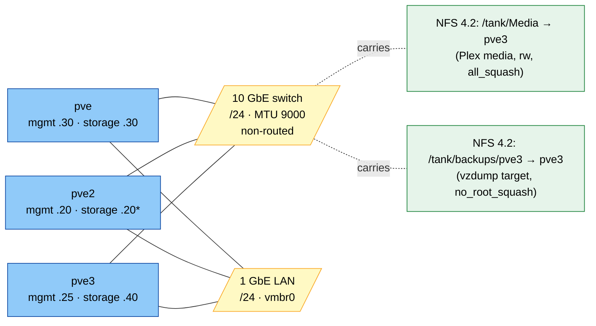

# Proxmox VE 9 — Homelab Infrastructure Documentation

> **Public / GitHub version** — sanitised for public sharing. Sensitive details (real IPs, MAC addresses, WAN details and account identifiers) are replaced with placeholders. Maintain the full internal version separately.

| | |
|---|---|
| **Maintainer** | `<MAINTAINER>` |
| **Repository** | `<REPO-URL>` |
| **Last updated** | 11 July 2026 |
| **Document version** | 2.0 |
| **Proxmox VE version** | 9.x (kernels: pve `7.0.6-2-pve` · pve3 `7.0.14-4-pve` · pve2 not re-captured this pass) |
| **Cluster name** | `<CLUSTER-NAME>` — **three nodes** |

> **v2.0 scope note.** This revision documents the July 2026 state: third node `pve3` (MINISFORUM MS-A2/MS-02-class unit with Intel Arc A310), the 10 GbE storage fabric and NFS layer, the Plex migration (CT 102 → CT 122 with GPU hardware transcode), the Windows 11 P2V VM (VM 150), per-node backups now covering all three nodes, and SMTP notification routing. Guests added between v1.3 (11 June) and this revision (arr stack, Vaultwarden, Tailscale router, Audiobookshelf, Calibre-Web) are inventoried in summary form in §4 — a fresh Appendix A export pass is on the backlog to bring them up to full per-guest detail.

---

## Related documents

- **`backup-restore-runbook.md`** — operational runbook for vzdump, snapshot, and ZFS restore procedures, including disaster scenarios.
- **`ha-qdevice-playbook.md`** — playbook for the (now-retired) QDevice era and the ZFS-replication HA path; superseded in part by the three-node join but retained for the pvesr/HA-rules design.
- **`eurooffice-nextcloud-PUBLIC.md`** — integration runbook for Euro-Office DocumentServer (CT 141) × Nextcloud (VM 111).
- **`nextcloud-vm-PUBLIC.md`** — runbook for the Nextcloud appliance itself (VM 111 mweelrea).

## Table of contents

1. [Overview](#1-overview)
2. [Architecture](#2-architecture)
3. [Storage](#3-storage)
4. [Compute inventory](#4-compute-inventory)
5. [Networking](#5-networking)
6. [SMB / NFS / NAS layer](#6-smb--nas-layer)
7. [Security & remote access](#7-security--remote-access)
8. [Operational runbook](#8-operational-runbook)
9. [Change log & known issues resolved](#9-change-log--known-issues-resolved)
10. [Explain like I'm 5](#10-explain-like-im-5)
11. [References](#11-references)
12. [Appendices](#12-appendices)

---

## 1. Overview

A **three-node** Proxmox VE 9 cluster (`ulster`) runs a mix of LXC containers and KVM virtual machines for RC COMMS's homelab and internal services. The platform hosts file sharing (SMB/CIFS/NFS), media streaming with GPU hardware transcode, Usenet/torrent automation (the *arr stack), DNS ad-blocking, smart home automation, photo backup, password management, and collaboration tooling. A Raspberry Pi 4 (`eagle`) sits **outside** the cluster providing monitoring (Uptime Kuma) and out-of-band SMS alerting over LTE.

### Why Proxmox VE?

Proxmox VE is a Debian-based open-source virtualisation platform that combines KVM hypervisor (for full VMs) and LXC (for lightweight Linux containers) under a single web UI and API, with built-in support for ZFS, Ceph and clustering. It avoids the licensing model of VMware while providing comparable enterprise features (live migration, HA, replication, snapshots).

### Why ZFS?

ZFS provides end-to-end checksumming (silent corruption detection), copy-on-write snapshots, compression (LZ4 by default), and the ability to expand pools online. RAIDZ expansion landed in upstream OpenZFS and is supported in PVE 9, which is useful for future capacity growth.

### Why LXC over VMs for most workloads?

LXC containers share the host kernel and avoid the overhead of a full guest OS, making them faster, lighter and quicker to boot than KVM VMs. For workloads that don't need a separate kernel (most Linux services), LXC is the obvious choice. VMs remain in use for appliances that bundle their own OS image (Home Assistant OS, Nextcloud appliance) and for the Windows 11 P2V guest (VM 150).

### Why a third node?

`pve3` was added in July 2026 for three reasons: **quorum** (a real third vote replaces the Raspberry Pi QDevice, which was removed prior to the join), **modern compute** (the two Gen10 MicroServers are RAM- and CPU-bound; pve3 brings 64 GB DDR5 and a current-generation CPU for LLM-adjacent and SIEM workloads), and a **discrete GPU** (Intel Arc A310) for media transcode — the driver for the Plex migration documented in this revision.

---

## 2. Architecture

### Physical hardware

**pve and pve2** are **HPE ProLiant MicroServer Gen10** units (AMD platform — not Gen10 Plus):

| Component | Specification |
|---|---|
| CPU | AMD Opteron X3421 APU — 4 cores @ 2.1 GHz base / 3.4 GHz turbo, integrated Radeon R7 graphics |
| RAM | 16 GB (DDR4 ECC SO-DIMM) |
| Drive bays | 4 × 3.5" SATA — 4 × 16 TB in RAIDZ1 per node (pool `tank` on each) |
| On-board NICs | Dual-port 1 GbE (Broadcom) |
| Add-in NIC | 10 GbE card in the PCIe slot (storage fabric — see §5); note the **NIC rename risk**: adding a card reshuffles PCI enumeration and renames onboard ports, and Gen10 has no iLO, so attach a physical console before applying network changes |
| Boot | **UEFI** (EFI System Partition on ESP, root on LVM-thin) |
| Out-of-band management | None (Gen10 non-Plus has no iLO) |

**pve3** is a **MINISFORUM MS-02-class workstation node** (joined July 2026):

| Component | Specification |
|---|---|
| CPU | Intel Core Ultra 9 285HX (Arrow Lake-HX) |
| RAM | 64 GB DDR5 ECC |
| iGPU | Intel Arrow Lake integrated graphics — PCI `0000:00:02.0` → `/dev/dri/card1` + `renderD128` |
| dGPU | **Intel Arc A310 (DG2)** — PCI `0000:04:00.0` → `/dev/dri/card2` + `renderD129`. GuC 70.53.0 (submission/SLPC/RC enabled), HuC authenticated, DMC v2.8. Passed into CT 122 for Plex hardware transcode (§4) |
| Storage | 1 TB Sabrent Rocket NVMe → single-disk ZFS pool `tank` (participates in the `vmstorage` storage ID); OS on LVM (root ~94 GB, `local-lvm` thinpool ~349 GB) |
| NICs | `nic0` (unused, up), `nic1` → 10 GbE storage fabric `<PVE3-STOR-IP>` |
| Known quirk | **Thunderbolt/USB4 root-port PCIe AER storm** under `intel_iommu=on` caused crashes during heavy transfers. Mitigated (BIOS update + `pcie_aspm=off` + thunderbolt module blacklist); confirmed stable through the VM 150 transfer and the CT 122 build. Verify the exact surviving mitigation set on the next kernel upgrade. |

**eagle** — Raspberry Pi 4, `<EAGLE-IP>`, **not a cluster member** (its corosync QDevice role was removed before the pve3 join). Runs Uptime Kuma and a Pimoroni Clipper HAT Mini for out-of-band SMS alerting over LTE (Lebara/Vodafone). Keeping monitoring outside the cluster's failure domain is deliberate.

The AMD APU's integrated GPU on pve2 is passed to CT 112 (Immich) for photo/video transcode; the Arc A310 on pve3 is passed to CT 122 (Plex). Note the render-node minor numbers differ per node — **on pve3 the A310 is `card2`/`renderD129`**, not the `card1`/`renderD128` pair the CT 112 template uses (see §4, CT 122).

**Hardware-related caveats:**
- No iLO/IPMI on the Gen10 nodes — every reboot must complete cleanly or requires physical access.
- 16 GB is a hard ceiling on the Gen10s; memory pressure remains the first bottleneck there. pve3's 64 GB is the headroom node — LLM service migration and the Wazuh SIEM VM (`gullion`) are planned for it.
- The Gen10 single PCIe slot is now consumed by the 10 GbE card.

### Cluster layout

```mermaid
flowchart TB
    classDef node fill:#E8F0FE,stroke:#1A73E8,stroke-width:2px,color:#000
    classDef vm fill:#FCE8E6,stroke:#D93025,stroke-width:1px,color:#000
    classDef ct fill:#E6F4EA,stroke:#188038,stroke-width:1px,color:#000
    classDef storage fill:#FEF7E0,stroke:#F9AB00,stroke-width:2px,color:#000
    classDef hw fill:#F1F3F4,stroke:#5F6368,stroke-width:1px,color:#000
    classDef mon fill:#EDE7F6,stroke:#5E35B1,stroke-width:1px,color:#000

    subgraph Cluster["Proxmox Cluster: ulster — PVE 9.x — 3 nodes, quorum 3"]
      direction LR

      subgraph PVE["Node: pve (<PVE-IP>)"]
        direction TB
        PVEHW["🖥️ HPE MicroServer Gen10<br/>Opteron X3421 · 16 GB"]:::hw
        TANK[("💾 ZFS: tank<br/>4×16 TB RAIDZ1 · 12.5 T used")]:::storage
        P1["CT 101 oriel · NAS<br/>CT 103 iveagh · Transmission<br/>CT 106 commedagh · Pi-hole pri<br/>CT 114 shanlieve · SABnzbd<br/>CT 115 doan · Sonarr<br/>CT 116 errigal · Radarr<br/>CT 119 meelmore · Audiobookshelf<br/>CT 120 meelbeg · Calibre-Web<br/>CT 141 eurooffice · Euro-Office DS"]:::ct
        P1V["VM 111 mweelrea · Nextcloud"]:::vm
        P1R["CT 121 bencrom · Vaultwarden<br/>(HA + pvesr, runs pve⇄pve2)"]:::ct
        P1X["CT 102 slemish · Plex<br/>⛔ RETIRED — stopped, destroy ≈18 Jul"]:::hw
      end

      subgraph PVE2["Node: pve2 (<PVE2-IP>)"]
        direction TB
        PVE2HW["🖥️ HPE MicroServer Gen10<br/>Opteron X3421 · 16 GB"]:::hw
        TANKB[("💾 ZFS: tank<br/>(renamed from tank2)")]:::storage
        P2["CT 104 donard · Pi-hole sec<br/>CT 105 slievemore · Tailscale router<br/>CT 109 knockbrinnea · Docker/Mealie<br/>CT 112 immich · Photos (iGPU)<br/>CT 117 conavalla · Prowlarr<br/>CT 118 beara · Seerr"]:::ct
        P2V["VM 113 breifne · Home Assistant<br/>(HA + pvesr, prefers pve2)"]:::vm
      end

      subgraph PVE3["Node: pve3 (<PVE3-IP>) — NEW"]
        direction TB
        PVE3HW["🖥️ MS-02 · Core Ultra 9 285HX<br/>64 GB DDR5 · Arc A310"]:::hw
        TANK3[("💾 ZFS: tank<br/>1 TB NVMe")]:::storage
        P3["CT 122 binnian · Plex<br/>Arc A310 HW transcode<br/>media via NFS ← pve"]:::ct
        P3V["VM 150 winmigrate · Windows 11 P2V"]:::vm
        P3F["(planned: VM gullion · Wazuh SIEM)"]:::hw
      end

      PVE <-. "corosync knet · 2 links<br/>link0 mgmt · link1 10GbE" .-> PVE2
      PVE2 <-. " " .-> PVE3
      PVE <-. " " .-> PVE3
    end

    EAGLE["🍓 eagle (RPi 4 · <EAGLE-IP>)<br/>Uptime Kuma + LTE SMS alerts<br/>NOT a cluster member"]:::mon
    EAGLE -. monitors .-> Cluster

    class PVE,PVE2,PVE3 node
```



### Key design decisions

- **Three-node cluster, no shared block storage.** Each node has its own ZFS pool (all now named `tank` locally; the Proxmox storage ID `vmstorage` spans `pve,pve2,pve3`, mapping to each node's local pool). Migration relocates disks; there is no shared SAN. The **exception introduced in July 2026** is file-level sharing: pve exports `/tank/Media` and `/tank/backups/pve3` over NFS on the 10 GbE fabric (§6), which is data-plane sharing for specific consumers, not cluster block storage.
- **Real quorum.** Three full votes (`Expected votes: 3`); any single node can fail without losing quorum. The Raspberry Pi QDevice used during the two-node era was removed before the pve3 join.
- **HA where it earns its keep.** Bidirectional `pvesr` ZFS replication plus HA resources exist for exactly two guests — CT 121 (Vaultwarden) and VM 113 (Home Assistant) — armed with `failback 0` and node-affinity rules, live-migration-tested in both directions. Everything else restarts from backup. Plex (CT 122) is **deliberately not HA**: its GPU and its NFS media mount exist only on pve3 (§4).
- **Unprivileged containers by default.** The retirement of CT 102 (July 2026) removed the largest privileged container; CT 103 (Transmission) is now the sole remaining privileged guest, with an unprivileged rebuild on the backlog. Container UID 0 maps to host UID 100000; the recurring operational consequence is documented in §6.
- **DNS redundancy.** Two Pi-holes (CT 106 on pve, CT 104 on pve2). A pve2 outage degrades DNS to the primary only — known concentration risk.
- **Hostname convention.** Guests are named after Irish mountains — Oriel, Slemish (retired with CT 102), Iveagh, Donard, Commedagh, Slievemore, Knockbrinnea, Breifne, Mweelrea, Shanlieve, Doan, Errigal, Conavalla, Beara, Meelmore, Meelbeg, Bencrom, and now **Binnian** (CT 122). Decouples hostname from function.
- **Monitoring outside the failure domain.** `eagle` provides Uptime Kuma + SMS alerting from outside the cluster, so a cluster-wide event can still page.

---
## 3. Storage

### Storage pool inventory (per `pvesm status`, 11 July 2026)

**As seen from pve:**

| Storage ID | Type | Status | Total | Used | Avail | % Used |
|---|---|---|---|---|---|---|
| `iso` | dir | active | 94 GB | 30 GB | 59 GB | 32.45% |
| `local` | dir | active | 94 GB | 30 GB | 59 GB | 32.45% |
| `local-lvm` | lvmthin | active | 794 GB | 58 GB | 737 GB | 7.27% |
| `node1_backup` | dir | active | 29.8 TB | 162 GB | 29.7 TB | 0.53% |
| `node2_backup` | dir | disabled (this node) | — | — | — | — |
| `tank` | zfspool | active | 42 TB | 12.5 TB | 29.7 TB | 29.58% |
| `vmstorage` | zfspool | active | 42 TB | 12.5 TB | 29.7 TB | 29.58% |
| `vmstoragelimited` | zfspool | active | 42 TB | 12.5 TB | 29.7 TB | 29.58% |

**As seen from pve3:**

| Storage ID | Type | Status | Total | Used | Avail | % Used |
|---|---|---|---|---|---|---|
| `iso` / `local` | dir | active | 94 GB | 23 GB | 66 GB | 24.52% |
| `local-lvm` | lvmthin | active | 349 GB | 0 | 349 GB | 0.00% |
| `node3_backup` | **nfs** | active | 29.8 TB (backed by pve `tank`) | — | 29.7 TB | 0.53% |
| `vmstorage` | zfspool | active | 899 GB | 70 GB | 829 GB | 7.81% |

pve2's view not re-captured this pass — refresh with `pvesm status` on pve2 (backlog, Appendix E).

**Important nuances:**

- `vmstorage`, `vmstoragelimited`, `tank`, `tank2`, `vmstorage2` are **storage IDs**, not separate pools. On every node the underlying local pool is now named `tank` — pve2's pool was **renamed from `tank2` to `tank`**, but the legacy storage IDs (`tank2`, `vmstorage2`) were retained and still point at it (`pool tank / nodes pve2`). The percentages within one node always match because they share the pool.
- `vmstorage` is the **cluster-spanning ID**: `nodes pve3,pve,pve2`. When editing storage IDs with `pvesm set`, **explicitly list all nodes** — omitting one silently drops it from the ID (this bit us once).
- `node1_backup`/`node2_backup` are `dir` storages at `/tank/backups` on their own node (the `shared 1` flag on them is technically inaccurate — different pools that share a path — but inert with single-node scoping). `node3_backup` is different: an **NFS storage** consumed by pve3 but physically living on pve's `tank` (see below).

### Storage definitions (`/etc/pve/storage.cfg`, current)

```ini
dir: local
        path /var/lib/vz
        content iso,vztmpl
        shared 0

lvmthin: local-lvm
        thinpool data
        vgname pve
        content images,rootdir

zfspool: tank
        pool tank
        content images,rootdir
        mountpoint /tank
        nodes pve

dir: iso
        path /storage/share/iso
        content iso,vztmpl
        prune-backups keep-all=1
        shared 0

zfspool: vmstorage
        pool tank
        content rootdir,images
        mountpoint /tank
        nodes pve3,pve,pve2
        sparse 1

zfspool: vmstoragelimited
        pool tank
        content rootdir,images
        mountpoint /tank
        nodes pve
        sparse 0

zfspool: tank2
        pool tank
        content rootdir,images
        nodes pve2
        sparse 0

zfspool: vmstorage2
        pool tank
        content rootdir,images
        nodes pve2
        sparse 0

dir: node1_backup
        path /tank/backups
        content backup
        nodes pve
        prune-backups keep-last=4,keep-weekly=4,keep-monthly=6,keep-yearly=1
        shared 1

dir: node2_backup
        path /tank/backups
        content backup
        nodes pve2
        prune-backups keep-last=4,keep-weekly=4,keep-monthly=6,keep-yearly=1
        shared 1

nfs: node3_backup
        export /tank/backups/pve3
        path /mnt/pve/node3_backup
        server <PVE-STOR-IP>
        content backup
        nodes pve3
        options vers=4.2
        prune-backups keep-last=4,keep-weekly=4,keep-monthly=6,keep-yearly=1
```

### ZFS datasets on `tank` (pve) — 11 July 2026

| Dataset | Used | Purpose |
|---|---|---|
| `tank` | 12.5 T (total) | Pool root — 29.7 T available |
| `tank/Media` | **11.3 T** | Media library — Plex source (now served to pve3 over NFS), Samba `Media` share, arr-stack import target |
| `tank/Downloads` | 254 G | Samba `Downloads` share, Transmission target |
| `tank/Podcasts` | 22.0 G | Podcast archive |
| `tank/archive` | 195 G | Cold storage — sanoid `archive` template (7d/4w/2m), local snapshots only, **outside restic off-site** |
| `tank/replica` | 254 G | syncoid replication landing area (peer datasets) |
| `tank/scratch` | 8.99 G | Churn area — vzdump staging, incomplete downloads; no snapshots |
| `tank/storage` | 252 G | General-purpose share — **the restic off-site scope** (new children auto-included; new siblings auto-excluded) |
| `tank/subvol-1xx-*` | various | LXC rootfs subvols (101, 103, 106, 114, 115, 116, 119, 120, 121) |
| `tank/vm-113-disk-*` | 49.4 G | **pvesr replica** of VM 113 (Home Assistant) from pve2 |

`/tank/backups` is a **plain directory** on the pool root (not a dataset) — deliberate: it stays outside dataset-scoped snapshot/replication policies and outside the restic `tank/storage` scope by name, so vzdump archives are never double-protected off-site.

### NFS exports from pve (10 GbE storage fabric)

Introduced July 2026 for the Plex migration and pve3 backups. Both exports are restricted to pve3's storage-fabric address only, on a non-routed subnet. Full design rationale and client-side units in §6.

```
# /etc/exports on pve (verify live state with exportfs -v)
/tank/Media         <PVE3-STOR-IP>(rw,sync,no_subtree_check,all_squash,anonuid=101000,anongid=101000)
/tank/backups/pve3  <PVE3-STOR-IP>(rw,sync,no_subtree_check,no_root_squash)
```

| Export | Consumer | Squash model | Why |
|---|---|---|---|
| `/tank/Media` | pve3 host → bind-mount into CT 122 (Plex) | `all_squash` to `101000:101000` | Every access arrives as the identity that owns the entire media tree, so Plex's read *and* delete paths work regardless of in-container UID or per-file modes. Chosen over UID idmapping after verifying tree ownership is uniformly `101000` but modes are mixed (some 775 directories). |
| `/tank/backups/pve3` | pve3 (`node3_backup` PVE storage) | `no_root_squash` | vzdump writes as root; squashing root would break every dump. Acceptable on a single-client, non-routed fabric. |

### Backup strategy

**Three scheduled per-node vzdump jobs** (weekend stagger), all `mode snapshot`, `zstd`, `notification-mode notification-system`, `repeat-missed 1`:

| Job | Node | Storage | Schedule | Guests |
|---|---|---|---|---|
| Node-1 weekly | `pve` | `node1_backup` (dir on pve `tank`) | **Sat 01:00** | 101, 102*, 103, 106, 111, 141, 114, 115, 116, 119, 120, 121 |
| Node-2 weekly | `pve2` | `node2_backup` (dir on pve2 `tank`) | **Sun 01:00** | 104, 113, 109, 112, 105, 117, 118, 121, 141 |
| **Node-3 weekly** | `pve3` | `node3_backup` (**NFS → pve `/tank/backups/pve3`**) | **Sun 03:00** | **122, 150** |

\* CT 102 (retired Plex) remains in the Saturday job **during the soak week only** — remove from the vmid list when the container is destroyed (~18 July).

- **Job retention:** `keep-last=4, keep-monthly=6, keep-yearly=1` on all three jobs. **Storage-level** prune on all three backup storages additionally carries `keep-weekly=4`. Precedence nuance, verified in practice: a scheduled job applies **its own** retention; a *manual* `vzdump` run without `--prune-backups` applies the **storage-level** policy (the 11 July manual run pruned with `keep-weekly=4` included). Harmless divergence, but worth knowing when counting retained archives.
- **Dual-listing** (121, 141 in both Gen10 jobs) covers migratable/HA guests wherever they happen to be running — vzdump skips guests not present on the job's node.
- **Consistency:** LXC snapshots ride ZFS CoW with freeze/thaw; VM 150's backup drives **Windows VSS via the QEMU guest agent** (`fs-freeze`/`fs-thaw` observed in the job log) — application-consistent, not merely crash-consistent. First node-3 run (11 July): CT 122 in 66 s (9.08 GB), VM 150 in 3 m 14 s (59.8 GB archive, 76% sparse), ~69 GB total over the 10 GbE fabric.
- **Bind-mounts correctly excluded:** CT 122's `mp0` (`/mnt/media`) is skipped as "not a volume" — the media itself is protected by the pve-side policy below, not by container dumps.
- **Second/third layers (unchanged from June):** sanoid snapshots + nightly syncoid cross-node replication of critical datasets; weekly dump-mirror rsync of each Gen10 node's vzdumps to the peer; nightly restic (encrypted, deduplicated) of `tank/storage` + Immich library to per-node repos on a Hetzner Storage Box BX11 (Falkenstein). **Deliberately out of scope:** `tank/Media`/`tank/Downloads` (~11.5 TB replaceable media) — ZFS redundancy plus a quarterly offline copy; accepted re-acquisition risk. pve3's vzdump archives inherit pve-side pool redundancy by landing on `tank`; they are *not* restic'd (backups of backups).
- **Notifications:** all jobs emit through the notification system, now routed to real mail (§8, *Notifications*).

---
## 4. Compute inventory

### Virtual machines

#### VM 111 — mweelrea (Nextcloud) — on pve

| Property | Value |
|---|---|
| Type | KVM VM (Community Scripts Nextcloud appliance — TurnKey 18.1 guest, Nextcloud Hub 34) |
| Machine / BIOS | q35 / SeaBIOS |
| vCPU / RAM | 2 cores / 4096 MB |
| Disks | `local-lvm:vm-111-disk-1` **80 GB** (grown from 40 GB), `vm-111-disk-2` 828 MB; EFI vardisk 4 MB |
| NIC | virtio, MAC `<MAC>`, bridge `vmbr0` |
| IP | <NEXTCLOUD-IP>/24 (DHCP — reservation required: public vhosts + CT 141 hosts pin) |
| Agent / Onboot | enabled / yes, order=4, up=60s |
| Notes | SMB external-storage mounts for all five family members; hosts the Apache TLS reverse proxy fronting CT 141 |
| Runbook | `nextcloud-vm-PUBLIC.md` |

#### VM 113 — breifne (Home Assistant OS) — on pve2 (preferred), HA-enabled

| Property | Value |
|---|---|
| Type | KVM VM — Home Assistant OS 17.x |
| BIOS / CPU | OVMF (UEFI) / x86-64-v2-AES, 2 cores |
| RAM | 4096 MB |
| Disk | `vmstorage2:vm-113-disk-0`, 32 GB (discard, iothread) |
| NIC | virtio, MAC `<MAC>`, `vmbr0`, firewall=1 |
| IP | <HA-IP>/24 (DHCP reservation) |
| **HA** | HA resource with node-affinity (prefers pve2), `failback 0`; **bidirectional pvesr replication** to pve (`tank/vm-113-disk-*` visible on pve is the replica). Live-migration-tested both directions. |
| Tags | `automation` |

#### VM 150 — winmigrate (Windows 11 P2V) — on pve3

Physical-to-virtual migration of the Windows 11 workstation. The original 1.82 TB `dd`-over-SSH clone refused to boot — root causes were **Riot Vanguard (`vgk.sys`)** and **WDAC/App Control policies** (`.cip`, `VbsSiPolicy.p7b`, `winsipolicy.p7b` in `CodeIntegrity/` and the ESP), both of which crash or block boot in a VM with no minidump (diagnostic signature: Kernel-Power 41, BugcheckCode 0, no event 1001). Resolution: clean Windows 11 install on a fresh 250 GB zvol. The 1.82 TB clone (`vm-150-disk-2`) has since been **destroyed**; its dangling `unused0` config reference was removed 11 July.

| Property | Value (per `qm config 150`, 11 July 2026) |
|---|---|
| Machine / BIOS | `pc-q35-11.0+pve1` / **OVMF** (`efidisk0: vmstorage:vm-150-disk-0`, ms-cert 2023k, pre-enrolled keys) |
| TPM | `tpmstate0: vmstorage:vm-150-disk-1`, v2.0 (Win11 requirement) |
| CPU / RAM | `cpu: host`, 4 cores × 2 sockets / 16384 MB, balloon 4096 |
| Disk | `scsi0: vmstorage:vm-150-disk-4`, 250 GB, discard, iothread, ssd=1 (52.1 G used on-pool) |
| SCSI / NIC | virtio-scsi-single / virtio, MAC `<MAC>`, `vmbr0` |
| Agent | enabled, `fstrim_cloned_disks=1` — gives VSS-consistent vzdump backups (§3) |
| **Open item** | **Windows activation** — in progress with Microsoft support ("motherboard replacement" route). Note: the offline-hive key-recovery option died with the clone's deletion. |

### LXC containers — full detail

#### CT 122 — binnian (Plex Media Server) — on pve3 ★ NEW (replaces CT 102)

Migrated 11 July 2026 from privileged CT 102 (pve) via `vzdump --mode stop` → `pct restore --unprivileged 1 --ignore-unpack-errors 1` (the two unpack errors are postfix chroot device nodes, which unprivileged namespaces cannot `mknod` — benign). Plex server identity, database and libraries carried over intact; the household cutover reused <PLEX-IP> so clients reconnected unaided.

| Property | Value (per `pct config 122`) |
|---|---|
| OS | Debian 12 (bookworm), sources include `non-free non-free-firmware` |
| Privileged | **No** (unprivileged) — retired the last privileged CT in the fleet |
| vCPU / RAM | 4 cores / 4096 MB + 4096 MB swap |
| Rootfs | `vmstorage:subvol-122-disk-0`, 28 GB (pve3 local NVMe — Plex transcode temp lands here by default, deliberately) |
| **Media** | `mp0: /mnt/media,mp=/mnt/media,replicate=0` — bind of the pve3 **host NFS automount** of pve's `/tank/Media` (§6). The container has no NFS client; it sees an ordinary directory. |
| **GPU** | `dev0: /dev/dri/card2,gid=44` · `dev1: /dev/dri/renderD129,gid=44` — the **Arc A310** pair. ⚠ Two traps encoded here: (1) on pve3 the A310 is `card2/renderD129` (the iGPU owns `card1/renderD128`) — verify with `ls -l /dev/dri/by-path` before copying the CT 112 template; (2) `gid=` maps to the **guest's** group table — this guest's gid 104 is `kvm`, not `render`, so both nodes are passed as gid 44 (`video`), which the `plex` user (uid 998) is already in. |
| Features | `nesting=1` — effectively mandatory for systemd 252 in unprivileged LXC |
| Network | `eth0` on `vmbr0`, firewall=1, MAC `<MAC>` (fresh — CT 102's MAC retired), IP **<PLEX-IP>/24**, gw <GATEWAY-IP> |
| DNS | <PIHOLE-PRI> |
| Onboot | yes, order=2, up=10s, down=20s |
| Tags | `lxc;plex` |
| Plex | 1.43.2 · hardware acceleration **on**, device pinned to *Intel DG2 [Arc A310]* · HW-accelerated encoding on, HEVC "sources only" · HDR tone mapping **enabled — Compute-engine offload not yet verified** (see backlog) · max CPU transcodes reduced to 2 (CPU is fallback only) |
| Drivers in-CT | `intel-media-va-driver-non-free` 23.1.1 (iHD — full DG2: HEVC Main10 dec+enc, AV1 dec+enc, VP9; all encode is `EncSliceLP`, which is correct — DG2 only has the low-power VDEnc path) · `intel-opencl-icd` 22.43 (tone-mapping caveat: DG2 OpenCL was immature at 22.43 — if HDR output is grey or a CPU core pins, upgrade from bookworm-backports) · `vainfo`, `intel-gpu-tools` |
| Boot hygiene | `systemd-networkd-wait-online` **disabled** (static IP; it was timing out 120 s and delaying Plex's autostart — the cause of "enabled but inactive" confusion post-restore) · `sys-kernel-config.mount` **masked** (configfs cannot mount in unprivileged LXC) |
| Known noise | `libusb_init failed` at every Plex start — USB/DVB tuner probe, no USB bus in an unprivileged CT; ignore |
| Validation | HW transcode proven: Video engine ~64% under `intel_gpu_top -d drm:/dev/dri/renderD129` (run on the **host** — perf counters aren't reachable from the unprivileged namespace), Render/3D at 0% |
| HA | **Deliberately none** — GPU device nodes and the host NFS mount exist only on pve3. Protected by weekly vzdump instead. |

#### CT 102 — slemish (Plex) — ⛔ RETIRED 11 July 2026

Privileged CT on pve, replaced by CT 122. Currently **stopped**, `onboot 0`, startup cleared; kept intact as rollback through the soak week. **Actions ~18 July:** `pct destroy 102`, remove `102` from the Saturday job vmid list, `rmdir /mnt/nfstest` on pve3. Its final vzdump (11 July, 8.99 GB) is retained under `node1_backup` retention. Historical config: privileged, `local-lvm:vm-102-disk-0` 28 GB, MAC `<MAC>`, raw `lxc.cgroup2`/`lxc.mount.entry` GPU lines (which had to be stripped from the restored config on pve3 — they pointed at `renderD128`, the **iGPU** there).

#### CT 101 — oriel (NAS / Samba) — on pve

| Property | Value |
|---|---|
| Privileged | No · 2 cores · 512 MB · rootfs `local-lvm:vm-101-disk-0` 8 GB · `nesting=1` |
| Mounts | `/tank/scratch`→`/mnt/scratch`, `/tank/Media`→`/mnt/media`, `/tank/Downloads`→`/mnt/downloads`, `/tank/storage`→`/mnt/storage` |
| Network | MAC `<MAC>`, IP <NAS-IP>/24, firewall=1 · DNS <PIHOLE-PRI> |
| Onboot | yes, order=1, down=30s · Tags `nas` |

#### CT 103 — iveagh (Transmission) — on pve

| Property | Value |
|---|---|
| Privileged | **yes** — with CT 102 retired this is now the *last* privileged container in the fleet; unprivileged rebuild on backlog · 1 core · 256 MB |
| Rootfs | `vmstorage:subvol-103-disk-1` 8 GB · unused: `subvol-103-disk-0` (cleanup candidate) |
| Mounts | `/tank/Media`→`/mnt/media`, `/tank/Downloads`→`/mnt/downloads` (replicate=0) |
| Network | MAC `<MAC>`, IP <TORRENT-IP>/24 · Onboot order=3 · Tags `torrent` · manual torrents only |

#### CT 104 — donard (Pi-hole secondary) — on pve2

Unprivileged · 1 core · 256 MB · `vmstorage2:subvol-104-disk-0` 4 GB · `nesting=1` · MAC `<MAC>` · IP <PIHOLE-SEC>/24 · Tags `dns`.

#### CT 106 — commedagh (Pi-hole primary) — on pve

Unprivileged · 1 core · 256 MB · `vmstorage:subvol-106-disk-0` 4 GB · `nesting=1` · MAC `<MAC>` · IP <PIHOLE-PRI>/24 · Onboot order=1, up=5s · Tags `dns`.

#### CT 109 — knockbrinnea (Docker + Mealie) — on pve2

Unprivileged · 2 cores · 1024 MB · `vmstorage2:subvol-109-disk-0` 50 GB · `keyctl=1,nesting=1` · MAC `<MAC>` · IP <DOCKER-IP>/24 · Tags `docker;mealie`.

#### CT 112 — immich (Immich photos) — on pve2

Unprivileged · 4 cores · 4096 MB · rootfs 600 GB · `keyctl=1,nesting=1,fuse=1` · **iGPU passthrough** `dev0: /dev/dri/card1,gid=44`, `dev1: /dev/dri/renderD128,gid=104` (note: valid gid mapping *for this guest* — do not copy blindly, see CT 122) · Immich **v2.7.5 native LXC** (migrated off Docker) · IP **<IMMICH-IP>** (reserve) · ML offloaded to the Fedora workstation · public via Cloudflare Tunnel `photos.<DOMAIN>`.

#### CT 141 — eurooffice (Euro-Office DocumentServer) — on pve

Unprivileged, `nesting=1` · Debian 12 · 4 cores / 4096 MB · `vmstorage:subvol-141-disk-0` 15 GB · MAC `<MAC>` · IP <EUROOFFICE-IP>/24 · Euro-Office DS 9.3.1 behind the VM 111 Apache proxy (`office.<DOMAIN>`) · Runbook: `eurooffice-nextcloud-PUBLIC.md`.

### LXC containers — added since v1.3 (summary — full `pct config` export pending, see backlog)

| CTID | Hostname | Node | Purpose | IP | Notes |
|---|---|---|---|---|---|
| 105 | slievemore | pve2 | **Tailscale exit node + subnet router** | <TAILSCALE-IP> | Hostname reused from retired CT 108 (backup server role superseded by restic/syncoid on hosts) |
| 114 | shanlieve | pve | SABnzbd (Usenet) | <SAB-IP> (port 7777) | Newshosting TLS 563; egress via Surfshark VPN Fusion per-device route on the BQ16; DHCP reservation for .35 on backlog |
| 115 | doan | pve | Sonarr 4.x | <SONARR-IP> | |
| 116 | errigal | pve | Radarr 6.x | <RADARR-IP> | |
| 117 | conavalla | pve2 | Prowlarr (NZBGeek, Full Sync) | <PROWLARR-IP> | |
| 118 | beara | pve2 | Seerr (family requests) | <SEERR-IP> | |
| 119 | meelmore | pve | Audiobookshelf | — | Tailscale-joined for in-car use |
| 120 | meelbeg | pve | Docker LXC — Calibre-Web-Automated + daily news recipes | — | News ingest 06:00 systemd timer |
| 121 | bencrom | pve⇄pve2 | **Vaultwarden 1.36.0** | <VAULT-IP> | **HA + bidirectional pvesr**; data on `tank/storage/bencrom` (inside restic scope); Cloudflare Tunnel + Access (YubiKey) |

Arr-stack storage rule (from the build): Usenet **complete** downloads must land inside `tank/Media` (same dataset as the Plex library) for atomic moves on import; incomplete/temp churn lives in `tank/scratch` with no snapshots.

### Boot order summary

**pve:** order=1 CT 101 (NAS) + CT 106 (DNS) → order=3 CT 103 → order=4 VM 111 → CT 141 should be order=5 (backlog). **Plex is no longer in pve's chain** — CT 102's slot (order=2) retired with it.

**pve3:** order=2 CT 122 (Plex). Cross-node subtlety: CT 122 depends on pve's NFS export, but pve3 can boot while pve is down — the **systemd automount** absorbs this (mount triggers on first access and retries; the CT starts regardless and Plex simply shows the library unavailable until pve returns). VM 150 has no explicit order.

**pve2:** default ordering throughout (backlog: make explicit).

---
## 5. Networking

### Two networks: management and storage

Since the pve3 join the cluster runs **two flat subnets**:

| Network | Subnet | Medium | Purpose |
|---|---|---|---|
| Management / services | `<LAN-NET>/24` | 1 GbE via `vmbr0` on each node | All guest traffic, web UIs, SSH, corosync **link0** |
| **Storage fabric** | `<STORAGE-NET>/24` | **10 GbE**, MTU 9000 (jumbo frames), unmanaged 10 GbE switch, **no gateway — non-routed** | NFS (media + backups), migration/replication traffic, corosync **link1** |



\* pve2's storage-fabric address follows the `.20` convention but was **not re-verified this pass** — confirm with `ip -br a` on pve2 (backlog).

### IP plan

| Host | IP | Role |
|---|---|---|
| Gateway | `<GATEWAY-IP>` | ASUS ZenWiFi BQ16 (reconcile vs Ubiquiti MAC seen in May baseline — backlog) |
| pve | `<PVE-IP>` / storage `<PVE-STOR-IP>` (`ens2`) | Cluster node 1 |
| pve2 | `<PVE2-IP>` / storage `<PVE2-STOR-IP>`* | Cluster node 2 |
| **pve3** | **`<PVE3-IP>`** / storage **`<PVE3-STOR-IP>`** (`nic1`) | **Cluster node 3** |
| eagle | `<EAGLE-IP>` | RPi 4 — Uptime Kuma + LTE SMS alerting (non-cluster) |
| CT 106 commedagh | `<PIHOLE-PRI>` | Pi-hole primary |
| CT 104 donard | `<PIHOLE-SEC>` | Pi-hole secondary |
| CT 105 slievemore | `<TAILSCALE-IP>` | Tailscale exit node / subnet router |
| CT 109 knockbrinnea | `<DOCKER-IP>` | Docker / Mealie |
| CT 101 oriel | `<NAS-IP>` | NAS / Samba |
| **CT 122 binnian** | **`<PLEX-IP>`** | **Plex (on pve3)** — address inherited from retired CT 102 at cutover |
| CT 103 iveagh | `<TORRENT-IP>` | Transmission |
| CT 114 shanlieve | `<SAB-IP>` | SABnzbd (DHCP reservation on backlog) |
| CT 115 doan | `<SONARR-IP>` | Sonarr |
| CT 116 errigal | `<RADARR-IP>` | Radarr |
| CT 117 conavalla | `<PROWLARR-IP>` | Prowlarr |
| CT 118 beara | `<SEERR-IP>` | Seerr |
| VM 111 mweelrea | `<NEXTCLOUD-IP>` (DHCP — reserve) | Nextcloud |
| CT 141 eurooffice | `<EUROOFFICE-IP>` | Euro-Office DS |
| CT 121 bencrom | `<VAULT-IP>` | Vaultwarden (HA — address follows the guest) |
| CT 112 immich | `<IMMICH-IP>` (reserve) | Immich |
| VM 113 breifne | `<HA-IP>` (reservation) | Home Assistant |

Both subnets are flat. VLAN segmentation (management / services / IoT / DMZ) remains a future improvement for the <LAN-NET>/24 side; the storage fabric is already isolated by being non-routed. The wider device inventory (IoT, endpoints, and the anomalies flagged in the May 2026 nmap baseline) is recorded in §9 and in the internally-held LAN topology diagram.

**WAN edge:** ASUS ZenWiFi BQ16 forwarding WAN 80/443 → VM 111 only; Surfshark **VPN Fusion** provides a per-device tunnel route for CT 114 (SABnzbd egress). WAN IP residential/dynamic — Cloudflare DDNS updater still on backlog.

### MAC address inventory

| Guest | MAC |
|---|---|
| VM 111 mweelrea | `<MAC>` |
| VM 113 breifne | `<MAC>` |
| **VM 150 winmigrate** | **`<MAC>`** |
| CT 101 oriel | `<MAC>` |
| CT 102 slemish *(retired)* | `<MAC>` — leaves inventory when 102 is destroyed |
| CT 103 iveagh | `<MAC>` |
| CT 104 donard | `<MAC>` |
| CT 106 commedagh | `<MAC>` |
| CT 109 knockbrinnea | `<MAC>` |
| CT 112 immich | `<MAC>` |
| **CT 122 binnian** | **`<MAC>`** (freshly minted at restore — deliberately *not* CT 102's, to avoid L2 conflict during the parallel-run validation) |
| CT 141 eurooffice | `<MAC>` |
| CT 105 / 114–121 | *pending inventory export pass (backlog)* |

### Bridge configuration

**pve** (`/etc/network/interfaces`) — `vmbr0` on the onboard 1 GbE pair (bridge-ports audit still open, see backlog), plus `ens2` carrying `<PVE-STOR-IP>/24` for the storage fabric. **pve2** — `vmbr0` on `enp3s0f1`, 10 GbE addition analogous (capture exact stanza next pass). **pve3** (verified 11 July):

```
vmbr0  → <PVE3-IP>/24 (management, bridges guest traffic)
nic1   → <PVE3-STOR-IP>/24 (10 GbE storage fabric)
nic0   → up, unaddressed (spare)
```

⚠ The v1.3 warning stands for pve: `vmbr0` shows two physical ports without bonding and with STP off — verify cabling / convert to a bond (backlog).

### Cluster network

Three nodes, three votes, **two corosync links** (knet): link0 on management, link1 on the storage fabric — the join required both `--link0` and `--link1` to be specified explicitly. Verify current state with `pvecm status`; expected:

```
Expected votes: 3    Total votes: 3    Quorum: 2
Nodes: pve (<PVE-IP>) · pve2 (<PVE2-IP>) · pve3 (<PVE3-IP>)
```

Any single node can now fail without quorum loss — the two-node-era QDevice on `eagle` was removed before the join. Join-sequence lessons preserved for the next node: TFA on `root@pam` blocks API joins (use `--use_ssh`), and the datacenter firewall can block management access to a new node immediately post-join — have console access ready.

---
## 6. SMB / NFS / NAS layer

### Samba shares (`/etc/samba/smb.conf` on CT 101)

```ini
[global]
   log file = /var/log/samba/log.%m
   logging = file
   map to guest = Bad User
   max log size = 1000
   obey pam restrictions = Yes
   pam password change = Yes
   panic action = /usr/share/samba/panic-action %d
   passwd chat = *Enter\snew\s*\spassword:* %n\n *Retype\snew\s*\spassword:* %n\n *password\supdated\ssuccessfully* .
   passwd program = /usr/bin/passwd %u
   registry shares = Yes
   server role = standalone server
   server string = oriel
   unix password sync = Yes
   usershare allow guests = Yes
   idmap config * : backend = tdb

[homes]
   browseable = No
   comment = Home Directories
   create mask = 0700
   directory mask = 0700
   valid users = %S

[printers]
   browseable = No
   comment = All Printers
   create mask = 0700
   path = /var/tmp
   printable = Yes

[Media]
   comment = Media
   path = /mnt/media
   read only = No
   valid users = @doctor doctor

[Downloads]
   comment = Downloads
   path = /mnt/downloads
   read only = No
   valid users = @doctor doctor

[storage]
   path = /mnt/storage
   read only = No
   valid users = @doctor doctor
```

### Unprivileged container UID mapping

This is the single most important thing to understand about file ownership on the NAS.

By default an unprivileged LXC remaps UID 0 inside the container to UID 100000 on the host. The user `doctor` (UID 1000 inside the container) is therefore UID **101000** on the host.

If files on `/tank/...` are owned by host UID 65534 (`nobody`) or by host root, the container user sees them as `nobody:nogroup` and cannot write to them. The fix is to set ownership on the **host** to `101000:101000`:

```bash
# Run on the pve host, not inside the container
chown -R 101000:101000 /tank/Downloads /tank/Media /tank/scratch /tank/storage
```

After this, `ls -l /mnt/...` inside CT 101 shows `doctor:doctor` and writes succeed.

### Client-side mount (Fedora desktop)

```
# /etc/fstab on the Fedora client
//<NAS-IP>/Downloads/onedrive/  /mnt/onedrive   cifs  credentials=/etc/samba/.creds,uid=1000,gid=1000,file_mode=0664,dir_mode=0775,vers=3.0,nounix,noserverino,nobrl,_netdev,x-systemd.automount  0  0
//<NAS-IP>/Downloads/           /mnt/downloads  cifs  credentials=/etc/samba/.creds,uid=1000,gid=1000,file_mode=0664,dir_mode=0775,vers=3.0,nounix,noserverino,nobrl,_netdev,x-systemd.automount  0  0
//<NAS-IP>/Media/               /mnt/media      cifs  credentials=/etc/samba/.creds,uid=1000,gid=1000,file_mode=0664,dir_mode=0775,vers=3.0,nounix,noserverino,nobrl,_netdev,x-systemd.automount  0  0
//<NAS-IP>/storage/             /mnt/storage    cifs  credentials=/etc/samba/.creds,uid=1000,gid=1000,file_mode=0664,dir_mode=0775,vers=3.0,nounix,noserverino,nobrl,_netdev,x-systemd.automount  0  0
```

**Critical mount options:**

| Option | Why |
|---|---|
| `credentials=` | Path to a `chmod 600` file containing `username=` and `password=` — keeps creds out of fstab and process listings |
| `uid=1000,gid=1000` | Maps server-side ownership to the local user on the client |
| `vers=3.0` | Forces SMB3 — faster, encrypted-capable, no SMB1 attack surface |
| `nounix` | Disables Unix extensions — **required for ZFS-backed shares**, prevents server-mapped permissions from clashing with the client's view |
| `noserverino` | Uses client-side inode numbers — fixes spurious "out of space" reports on ZFS |
| `nobrl` | Disables byte-range locking — fixes write errors with large files (sqlite, torrent, photo apps) |
| `_netdev` | Tells systemd this is a network mount — defers until network is up |
| `x-systemd.automount` | Lazy-mounts on first access — boot doesn't block on the NAS being up |

The credentials file format is critical: **no quoting, no escaping**. If the password contains spaces, write the literal spaces:

```ini
# /etc/samba/.creds  (chmod 600 root:root)
username=doctor
password=My Plain Text Password
```

`\040` escapes work in fstab paths but **not** inside the credentials file, and not on the command line.

On the Fedora client, `mount.cifs` must be setuid to allow user-context mounts:

```bash
sudo chmod u+s /sbin/mount.cifs
```

---

### NFS over the 10 GbE storage fabric (added July 2026)

The SMB layer above serves end-user clients. The **NFS layer** serves exactly one consumer — pve3 — over the dedicated 10 GbE fabric, and exists for two workloads: Plex's media (read + delete) and pve3's vzdump target.

**Server side (pve).** `nfs-kernel-server`; exports locked to pve3's fabric address on a non-routed subnet:

```
/tank/Media         <PVE3-STOR-IP>(rw,sync,no_subtree_check,all_squash,anonuid=101000,anongid=101000)
/tank/backups/pve3  <PVE3-STOR-IP>(rw,sync,no_subtree_check,no_root_squash)
```

Apply with `exportfs -ra`, verify with `exportfs -v`.

**Why `all_squash` on the media export.** The media tree is uniformly owned by `101000:101000` (the arr stack's write identity through the unprivileged offset), but per-file modes are mixed (some imports are 775). Plex deletes media from its UI, and deletion is a *directory write* — so "world-readable is enough" doesn't hold. Squashing **every** NFS access to the owning identity makes the whole permission question disappear server-side: nothing inside CT 122 needs matching UIDs, groups or modes. The end-to-end proof is one line — a root-created test file on the client appears owned `101000:101000`:

```bash
# from pve3 (as root)
touch /mnt/media/movies/.rwtest && ls -n /mnt/media/movies/.rwtest && rm /mnt/media/movies/.rwtest
# -rw-r--r-- 1 101000 101000 ...  ← squash working
```

**Why `no_root_squash` on the backup export.** vzdump writes as root; squashing root breaks every dump. Acceptable on a single-client, non-routed fabric carrying only backup traffic.

**Client side (pve3) — media.** The mount is owned by **systemd automount**, not fstab, and this is load-bearing for boot independence:

```ini
# /etc/systemd/system/mnt-media.mount        (no [Install] — only the automount is enabled)
[Unit]
Description=NFS mount of tank/Media from pve (10GbE)
After=network-online.target
Wants=network-online.target
[Mount]
What=<PVE-STOR-IP>:/tank/Media
Where=/mnt/media
Type=nfs4
Options=nfsvers=4.2,hard,proto=tcp,noatime,_netdev

# /etc/systemd/system/mnt-media.automount
[Unit]
Description=Automount for /mnt/media (NFS media from pve)
[Automount]
Where=/mnt/media
TimeoutIdleSec=0
[Install]
WantedBy=multi-user.target
```

`systemctl enable --now mnt-media.automount`. Design notes: **only the automount is enabled** — if pve is down when pve3 boots, boot completes and the mount simply triggers (and retries) on first access, so CT 122 always starts; `TimeoutIdleSec=0` prevents idle unmount under a live Plex; `hard` is correct for a media source (a stall during a pve reboot beats silent I/O errors); negotiated mount shows `vers=4.2, rsize/wsize=1 MiB, proto=tcp` (`findmnt /mnt/media`).

**Client side (pve3) — backups.** No units: the `node3_backup` NFS storage in `storage.cfg` (§3) is mounted by Proxmox itself at `/mnt/pve/node3_backup`.

**Into the container.** CT 122's `mp0` binds the host path: `pct set 122 -mp0 /mnt/media,mp=/mnt/media,replicate=0`. The `pct start` path lookup triggers the automount before the bind captures it, so ordering is self-solving. The container carries no NFS client and no credentials.

**Failure modes.** pve down → Plex library "unavailable", streams stall (hard mount), recovers on export return, no corruption. Fabric down → same. pve3 reboot with pve up → clean cold chain (validated 11 July): automount → NFS → bind → Plex autostart within seconds (after removing the `systemd-networkd-wait-online` stall, §4 CT 122).

**What this did *not* change:** Samba on CT 101 still exports the same `/tank/Media` to end-user clients, and Nextcloud's external-storage mounts are untouched. NFS is additive — a second read/write path for one consumer.


---

## 7. Security & remote access

### Web UI / admin-plane exposure — closed June 2026

Until June 2026 the Proxmox web UI on `pve` was reachable from the public internet at `https://<PVE-HOSTNAME>:8006/` via a WAN port-forward on the BQ16. This exposed the **hypervisor management plane** (root over every guest and all storage) to the internet — port 8006 is a known Proxmox fingerprint and such hosts are routinely indexed by Shodan/Censys and subjected to credential attacks. There was no pre-auth RCE in the running 9.x web UI at the time (the relevant 2025 PVE advisories — CVE-2025-57538 config-panel injection, CVE-2025-57540 WebAuthn-field stored XSS — are both *authenticated*), but credential attack plus an authenticated privilege-escalation path is a realistic chain, and the next unpatched pveproxy bug should not find this box exposed.

**Resolution (11 June 2026):**

1. **WAN port-forward for 8006 removed** at the BQ16 edge. SSH (22) is not forwarded either. The web UI and SSH are no longer reachable from the internet.
2. **Tailscale** installed **directly on the `pve` host** (not in a guest LXC — the host must not depend on a guest running *on* it for its own management path). Access is now via the tailnet address / MagicDNS name on 8006. This consolidates with the Tailscale rollout planned for the LLM stack.
3. **Datacenter firewall enabled** as a backstop (see rules below).
4. **Two-factor authentication enabled** (see below).

> **Why Tailscale over Cloudflare here.** A CF Tunnel + Access would work (it supports the WebSocket upgrade noVNC/xterm need) but keeps the box reachable on a *public hostname* gated only by an Access policy — strictly more exposure than "not on the internet at all." For a hypervisor admin plane touched infrequently, off-the-internet via WireGuard mesh is the right trade. Cloudflare remains the right tool for things intended to be *published* (e.g. the Nextcloud/Euro-Office 443 vhosts, which legitimately stay public).

### Tailscale install (host)

```bash
# On the pve host. apt aborts if the enterprise (no-subscription) repo 401s,
# so make sure pve-enterprise.sources is removed / pve-no-subscription is present first.
curl -fsSL https://tailscale.com/install.sh | sh
systemctl enable --now tailscaled
tailscale up          # authenticate via the printed URL
```

A subnet-router LXC advertising `<LAN-NET>/24` can be added later to pull the rest of the homelab onto the tailnet in one hop — but the **host itself remains its own node** so management never depends on a guest.

### Datacenter firewall

Enabled at **Datacenter** level, applied to both nodes. Rules (all `in`, `ACCEPT`, with a final `DROP`):

| # | Source | Dest | D.Port | Purpose |
|---|---|---|---|---|
| 0 | `<LAN-NET>/24` | <PVE-IP> | 8006 | LAN → pve web UI |
| 1 | `<LAN-NET>/24` | <PVE2-IP> | 8006 | LAN → pve2 web UI |
| 2 | `<LAN-NET>/24` | <PVE-IP> | 22 | LAN → pve SSH |
| 3 | `100.64.0.0/10` | <PVE-IP> | 8006 | Tailnet → pve web UI |
| 4 | `<LAN-NET>/24` | <PVE2-IP> | 22 | LAN → pve2 SSH |
| 5 | `100.64.0.0/10` | <PVE-IP> | 22 | Tailnet → pve SSH |
| 6 | — | — | — | **DROP** (default) |

Notes and caveats:
- **Source port must be blank on every rule.** S.Port is the client's *ephemeral* source port; populating it with 8006/22 means no rule ever matches and everything falls through to DROP — a self-lockout. Only **Dest. port** is set. (This bug was caught and fixed before enabling.)
- The firewall is **stateful** — no outbound rules are needed for return traffic, apt, or Tailscale coordination.
- Tailscale falls back to **DERP relay** because unsolicited inbound UDP 41641 is dropped. Invisible for occasional admin use; add an `ACCEPT udp/41641` only if direct peer-to-peer latency ever matters.
- **Tailnet rules (3, 5) currently cover `pve` (.30) only.** Neither pve2 (.20) nor **pve3 (.25)** has a tailnet rule — both are reachable over LAN / the CT 105 subnet router, but not directly by tailnet IP. Add equivalents if they get their own Tailscale nodes. Also verify the LAN 8006/22 ACCEPT rules were extended to cover <PVE3-IP> post-join (the join briefly tripped on this — see §5 cluster notes).
- **Recovery if locked out:** keep a root shell open when first enabling — `pve-firewall stop`, or set `enable: 0` in `/etc/pve/firewall/cluster.fw`. Console access is via the node's physical DisplayPort/VGA (no iLO on Gen10 — see §2).

### Two-factor authentication

TOTP 2FA is enabled on the Proxmox login (Datacenter → Permissions → Two Factor). The TOTP seed is enrolled in **two** authenticators for redundancy so a single lost device doesn't lock out admin access:

- **Google Authenticator**
- **Keeper** (password manager's built-in TOTP)

Both generate the same 6-digit code from the shared seed. Recovery/scratch codes should be stored in the Keeper vault alongside the entry.

> **Hardening still on the backlog:** stop using `root@pam` for daily login in favour of a dedicated admin user with its own 2FA; rotate the root password (assume the previously-exposed one is burned); the existing WebAuthn/hardware-key path can be added as a second factor type later.

### Related prior findings

The May 2026 nmap baseline (§9) flagged several exposures still worth tracking — the Proxmox REST API observed on TCP 3128, rpcbind (111) on the NAS, and the unexplained SOCKS5/proxy ports on the Amazon and Android devices. Those remain in the change log for action; the 8006 WAN exposure closed here was the most severe of the set.

---

---

## 8. Operational runbook

### Updates and patching

Patching across the host and all containers/VMs is automated with the **BassT23 Proxmox Updater** (currently **version 4.5.2**):

- Repository: <https://github.com/BassT23/Proxmox>
- Script: `Update-All.sh`
- What it does: updates the PVE host(s), then iterates through every running container and VM and runs the appropriate package manager (`apt`, `yum/dnf`, etc.) inside each guest. Supports snapshot-before-update, Slack/Telegram/Gotify notifications, and selective exclusion lists.
- Cadence: monthly manual run, plus on-demand before any infrastructure change. Run from pve first, then pve2, then pve3 (the script handles cluster-wide guest enumeration automatically).
- Update history visible in `/var/log/Update-All.log` on each node.

```bash
# Manual one-shot invocation
bash <(curl -fsSL https://raw.githubusercontent.com/BassT23/Proxmox/main/Update-All.sh)

# Or if cloned locally:
/opt/Proxmox/Update-All.sh
```

**Before running on this cluster:** confirm both nodes are quorate (`pvecm status`) and free space on root (`df -h /`) is >5 GB. The script will refuse to upgrade if either condition fails.

### Daily checks

```bash
pvecm status              # Cluster health
pvesm status              # Storage utilisation
zpool status              # Pool health
zpool list                # Pool capacity
qm list                   # Running VMs
pct list                  # Running containers
journalctl -p err -b      # Errors since last boot
```

### Adding a new dataset and exporting it as SMB

```bash
# On pve (the host):
zfs create tank/newshare
chown -R 101000:101000 /tank/newshare         # so unprivileged CT 101 can write
pct set 101 -mp4 /tank/newshare,mp=/mnt/newshare
pct reboot 101
```

Then on CT 101, add a `[newshare]` block to `/etc/samba/smb.conf` and `systemctl reload smbd`.

### Snapshots

```bash
# Container / VM snapshot via Proxmox (preferred — includes config)
pct snapshot 101 before-change
qm snapshot 111 before-change

# ZFS-level snapshot of a dataset (cheaper, but no config bundled)
zfs snapshot tank/storage@$(date +%Y%m%d-%H%M%S)

# List snapshots
pct listsnapshot 101
zfs list -t snapshot tank
```

### Migrating a guest between nodes

Because block storage is **not shared**, online migration requires copying disks:

```bash
# Live migrate a VM (relocates disks to the target's pool)
qm migrate 111 pve2 --online --with-local-disks --targetstorage vmstorage2

# Containers cannot live-migrate; restart-migrate is the option
pct migrate 101 pve2 --restart --target-storage vmstoragelimited2

# HA/replicated guests (CT 121, VM 113) migrate near-instantly along their
# pvesr replicas — the HA stack handles placement; respect the affinity rules.
```

**Guests that must NOT be migrated:** CT 122 (Plex — its `dev0/dev1` GPU nodes and the `/mnt/media` host mount exist only on pve3; a migrated copy will not start) and CT 112 (Immich — pve2 iGPU). Bind-mount guests (101, 103) are pinned to pve by their `/tank` paths unless the mounts are reworked.

### Stale lock recovery

```bash
# If a Proxmox task hangs and leaves a stale lock:
rm /var/lock/qemu-server/lock-<VMID>.conf      # for VMs
rm /var/lock/lxc/pve-config-<CTID>.lock        # for CTs
```

### Quorum recovery

With three nodes, **any single node failure keeps the cluster quorate (2/3)** — no manual action needed. Only a *double* failure requires intervention on the last survivor:

```bash
# On the sole surviving node — lower expected votes
pvecm expected 1
# When the others return, quorum auto-restores
```

**Do not** make this permanent (split-brain risk). Restore the failed nodes ASAP.

### Notifications (added July 2026)

All three vzdump jobs (and pvesr/HA events) use `notification-mode notification-system`. Routing lives in `/etc/pve/notifications.cfg` (cluster-wide; SMTP credentials in root-only `/etc/pve/priv/notifications.cfg`):

- **Targets:** `mail-to-root` (legacy sendmail — effectively a local-spool black hole) and **`Mailbox`** — SMTP via `<SMTP-SERVER>`, TLS on 465, from `<FROM-ADDRESS>`, delivering to `root@pam`'s configured email address.
- **Matcher:** `default-matcher` → `match-severity notice,warning,error`, `mode all`, **`target Mailbox`** (retargeted 11 July from `mail-to-root`; test delivered). `notice` retained deliberately — three "backup successful" mails per weekend act as a heartbeat; silence on a Sunday is itself a signal.
- **Test a target:** `pvesh create /cluster/notifications/targets/Mailbox/test`
- **Prerequisite:** `root@pam` must have an email set (`pveum user modify root@pam --email …`) or SMTP has nowhere to deliver.
- **Outstanding cosmetic:** the matcher comment still reads "mail-to-root" (backlog).

### Restoring a privileged CT as unprivileged (the CT 122 pattern)

Proven 11 July on the Plex migration; reusable for CT 103:

```bash
# 1. On the source node — stop-mode dump to a churn dataset, not root
vzdump <CTID> --mode stop --compress zstd --dumpdir /tank/scratch/dump

# 2. Move the archive (use the 10GbE addresses for cross-node copies)
rsync -ah --progress /tank/scratch/dump/vzdump-lxc-<CTID>-*.tar.zst root@<STORAGE-NET>.x:/var/lib/vz/dump/

# 3. Restore as a NEW ID, unprivileged
pct restore <NEWID> /var/lib/vz/dump/<archive>.tar.zst --storage vmstorage \
    --unprivileged 1 --ignore-unpack-errors 1
```

Expected/known behaviours: `--unprivileged 1` applies the +100000 UID shift during extraction, preserving in-container ownership; **`--ignore-unpack-errors` is needed if the source ran postfix** (its chroot device nodes can't be `mknod`'d in a user namespace — the two tar errors are benign; postfix wasn't even failing at boot in CT 122). Before first start: strip any raw `lxc.cgroup2.devices.allow`/`lxc.mount.entry` lines carried in the config (direct edit of `/etc/pve/lxc/<ID>.conf`, `.bak` first — `pct set --delete` can't remove raw lines), rebuild `net0` **without `hwaddr`** for a fresh MAC and with a temporary IP so old and new can run in parallel, and add `features: nesting=1` (systemd ≥252 misbehaves without it). After first boot: check `systemctl is-system-running` / `--failed` in the guest — `sys-kernel-config.mount` will fail (mask it) and `systemd-networkd-wait-online` may stall enabled services by 120 s (disable it for static-IP guests). Validate fully, cut identity (IP) over, keep the original stopped through a soak week, then destroy.

---

## 9. Change log & known issues resolved

### July 2026 — Plex migrated to pve3 with Arc A310 hardware transcode (CT 102 → CT 122)

Plex moved from privileged CT 102 (pve, CPU transcode) to unprivileged CT 122 `binnian` (pve3, Arc A310 VAAPI transcode), with the ~11 TB media library staying on pve and served over a new NFS-on-10GbE path. Architecture: NFS export of `/tank/Media` with `all_squash` to the tree's owning UID (rw, delete-from-Plex proven end-to-end); systemd **automount** on the pve3 host for cross-node boot independence; bind-mount into the CT; PVE-native `dev0/dev1` GPU passthrough. Migration mechanics: `vzdump --mode stop` (4 m 22 s outage) → rsync over the fabric → `pct restore --unprivileged 1 --ignore-unpack-errors 1` (postfix chroot device nodes can't be `mknod`'d in a user namespace — benign) → config surgery before first boot (strip CT 102's raw `lxc.` GPU lines, which pointed at what is the **iGPU** on pve3; fresh MAC + temp IP to run in parallel with live 102; `nesting=1` for systemd 252) → validation → cutover to <PLEX-IP> with server identity intact, family clients reconnected unaided. Gotchas worth remembering: the A310 is **`card2`/`renderD129`** on pve3 (`by-path` is the arbiter, not habit); `--dev gid=` maps into the **guest's** group table (this guest's 104 = `kvm`, not `render` — both nodes passed as gid 44/`video`); `systemd-networkd-wait-online` timing out made an enabled Plex look dead for the first two minutes of every boot (disabled — static IP); `sys-kernel-config.mount` can never mount unprivileged (masked); bookworm needs `non-free` added for `intel-media-va-driver-non-free` (23.1.1, full DG2 profile set — all encode entrypoints are `EncSliceLP` by design); `libusb_init failed` is tuner-probe noise. HW transcode proven at ~64% Video-engine load with Render/3D at 0%. Open: HDR tone-mapping enabled but Compute-engine offload unverified (OpenCL 22.43 caveat — backports fix if grey output or a pinned core appears); CT 102 destroy + Sat-job cleanup after the soak week.

### July 2026 — pve3 backups (NFS target) and SMTP notification routing

Third weekly vzdump job created for pve3 (Sun 03:00 — staggered off Sat/Sun 01:00): guests 122 + 150 → new `node3_backup` **NFS storage** backed by pve's `/tank/backups/pve3` (export `no_root_squash`, single-client). First run: CT 122 in 66 s, VM 150 in 3 m 14 s with **guest-agent fs-freeze → Windows VSS** (application-consistent), 59.8 GB archive at 76% sparse, ~69 GB total across the fabric. Retention matched to the sibling jobs; noted that manual `vzdump` runs apply the *storage-level* prune policy (which includes `keep-weekly=4`) while scheduled jobs apply their own. Separately, the notification **default-matcher was retargeted** from the `mail-to-root` sendmail black hole to the configured `Mailbox` SMTP target (`<SMTP-PROVIDER>`, TLS 465) after a successful `pvesh create /cluster/notifications/targets/Mailbox/test` — backup results, replication failures and fencing events now reach a real inbox. Severity kept at `notice,warning,error` (positive weekly heartbeat preferred). Also closed: VM 150's dangling `unused0` reference (the 1.82 TB P2V recovery clone no longer exists on any node — note this removed the offline-hive Windows-activation route; activation continues via Microsoft support).

### Late June – early July 2026 — third node, HA, arr stack, Vaultwarden, Windows P2V (consolidated)

Condensed record of the changes between v1.3 and this revision; each deserves its own runbook section in a future pass. **pve3 join:** MS-02-class node joined `ulster` on a two-link corosync config (`--link0`/`--link1` both required); the RPi QDevice was removed beforehand; TFA on `root@pam` forced `--use_ssh`; post-join the datacenter firewall briefly blocked the new node's management access. Thunderbolt/USB4 PCIe **AER storm** under `intel_iommu=on` caused crashes mid-transfer — mitigated via BIOS update + `pcie_aspm=off` + thunderbolt module blacklist, since stable. **HA/replication:** bidirectional pvesr for CT 121 (Vaultwarden) and VM 113 (Home Assistant), HA resources with `failback 0` + node-affinity, live-migrated both directions (note: `pve-ha-lrm` on pve was disabled for maintenance in early July — re-enable is on the backlog). **arr stack:** CT 114–118 (SABnzbd/Sonarr/Radarr/Prowlarr/Seerr) with the atomic-import storage rule (complete downloads inside `tank/Media`; churn in `tank/scratch`), Surfshark VPN Fusion egress for SABnzbd. **Also:** CT 105 (Tailscale exit node/subnet router, hostname reused from retired CT 108), CT 119 (Audiobookshelf), CT 120 (Calibre-Web-Automated + news recipes), CT 121 (Vaultwarden behind Cloudflare Tunnel + Access with YubiKey), pve2 pool renamed `tank2`→`tank` (storage IDs kept), Immich to v2.7.5 native LXC at <IMMICH-IP>. **VM 150 (Windows 11 P2V):** 1.82 TB `dd`/SSH/zstd clone wouldn't boot — Riot Vanguard (`vgk.sys`) and WDAC/App-Control policies are the documented P2V killers (no minidump; Kernel-Power 41 / BugcheckCode 0 with no event 1001 is the signature; `.cip` + `*SiPolicy.p7b` under `CodeIntegrity/` and the ESP must go). Clean install on a 250 GB zvol instead; activation open with Microsoft.

### June 2026 — Cross-node replication and off-site backup ("Phase 1" data-protection build)

Closed the two backup gaps left by the per-node vzdump rework. **sanoid** now snapshots the critical datasets on both nodes (14d/8w/6m/1y); **syncoid** pulls each node's critical dataset to the peer's pool nightly at 02:00 (`--no-sync-snap`, replica stanzas prune-only); weekly **dump-mirror** rsync jobs copy each node's vzdump directory to the other pool (Sat/Sun 06:00); and nightly **restic** (03:00) backs up `tank/storage` and the Immich library, encrypted, to per-node repos on a Hetzner Storage Box BX11 — sub-accounts jailed per node, key auth over SFTP port 23, retention 7d/4w/6m/1y with a 2% read-data verify per run. Hetzner-side daily snapshots + delete protection + console MFA (TOTP/YubiKey) provide the immutable layer; restic passphrases and box credentials escrowed in Keeper plus offline paper. Storage-level `prune-backups` on `node1_backup`/`node2_backup` aligned with job retention (was `keep-all=1`). Gotchas hit during the build, for posterity: Storage Box sub-account keys live in `<base-dir>/.ssh/authorized_keys` uploaded via the main account (the console Security → SSH keys page is Cloud-only); sub-accounts need **External reachability** ticked; the box root is `/home`; and heredoc-built scripts must be pasted at the shell, not into nano.

### June 2026 — Proxmox admin plane taken off the public internet

The `pve` web UI, previously reachable at `https://<PVE-HOSTNAME>:8006/` via a BQ16 WAN port-forward, was removed from the internet. Access is now via **Tailscale installed on the host**, with the **Datacenter firewall** enabled (LAN + tailnet `100.64.0.0/10` to 8006/22 only, default DROP) as a backstop, and **TOTP 2FA** enrolled in both Google Authenticator and Keeper. No pre-auth RCE existed in the running 9.x UI (the 2025 PVE advisories are authenticated-only), so this closed a credential-attack / authenticated-escalation exposure rather than an active compromise path. A self-lockout bug in the first firewall draft (Source port populated on every rule, so nothing matched and all traffic hit the DROP) was caught and fixed before enabling — only Dest. port is set. Full detail in §7.

### June 2026 — Euro-Office DocumentServer deployment (CT 141)

Collaborative document editing added to Nextcloud via Euro-Office DocumentServer 9.3.1 (the community fork of ONLYOFFICE DS) in a new Debian 12 LXC on pve. Apache on VM 111 became a name-based TLS-terminating reverse proxy for `office.<DOMAIN>` on the existing 443 forward — no new ports. Second certificate via certbot DNS-01 (Cloudflare token) coexisting with the TurnKey dehydrated HTTP-01 renewal. Two packaging defects found and worked around (docservice ignores `local.json` — `default.json` is the live config; nginx `secure_link` secret mismatch causing 403s), plus an IPv6/no-route issue fixed via `gai.conf`. Full detail, update procedure and verification tooling: `eurooffice-nextcloud-PUBLIC.md`. pve committed RAM rose to ~13.1 GB / 16 GB — ARC cap recommended (§2).

### May 2026 — Network scan baseline (nmap)

A full `/24` scan was taken on 16 May 2026 (`nmap -sS -O -sV -T4 --open`) to establish a network baseline. Twenty-five hosts up; findings worth acting on:

| Finding | Detail | Action |
|---|---|---|
| **VM 111 (Nextcloud) settled on <NEXTCLOUD-IP>** | DHCP-assigned; was documented as unfixed | Pin a DHCP reservation in the router and update inventory |
| **CT 112 (Immich) settled on <IMMICH-IP>** | DHCP-assigned; was documented as unfixed | Pin a DHCP reservation in the router and update inventory |
| **Proxmox REST API observed on TCP 3128**, not 8006 | Default is 8006 — 3128 is unusual (classic Squid port) | Investigate — verify pveproxy listener config, confirm intentional vs misconfig |
| **NAS (CT 101) exposes RPC (port 111)** | rpcbind responding from external scans | Firewall to LAN-only or disable if unused — `systemctl mask rpcbind` if NFS isn't needed |
| **Both Pi-holes expose ports 80 AND 443 as "webdav"** | Pi-hole admin only needs port 80 typically | Verify whether HTTPS admin is intentional — if not, lighttpd config should drop 443 |
| **Amazon device (<AMAZON-IP>) and Android (<ANDROID-IP>) both running SOCKS5 on 1080 + HTTP on 8888 + 9091** | Unusual ports; SOCKS5 proxy on an Echo/Fire device is not default behaviour | Investigate — could be Amazon "Sidewalk" mesh, a developer-mode app, or a compromised app. Worth tcpdump'ing outbound traffic |
| **Unknown <UNKNOWN-IP>** (MAC `<MAC>`) | Visible in ARP, no open ports detected | Identify by physical inventory or OUI lookup — could be a printer, Sonos sub, smart plug |
| **Single flat /24** | No VLAN separation between IoT, services, endpoints | Future improvement — VLAN-segment when network gear permits (router supports it, switch may need replacing) |

Scan retained at `/root/scans/scan-2026-05-16.xml` on pve. Re-run quarterly to catch unexpected new hosts.

### May 2026 — Upgrade from PVE 8.4 to PVE 9.1.9

Both nodes upgraded following the [official PVE 8→9 upgrade guide](https://pve.proxmox.com/wiki/Upgrade_from_8_to_9). Order: **pve2 first, then pve**, because guests can be migrated from an older PVE version to a newer one but not vice versa.

**Pre-flight steps applied:**
1. `pve8to9 --full` run on each node, all warnings cleared.
2. `apt install grub-efi-amd64` run on each node (mitigates the known `grub-on-LVM` boot failure during the upgrade — `disk 'lvmid/...' not found`).
3. `/etc/sysctl.conf` checked for custom values (none) — PVE 9 only honours `/etc/sysctl.d/*.conf`.
4. tmux session opened to survive SSH disconnects during the upgrade.
5. Repos switched from bookworm → trixie; `pve-no-subscription` repo updated to PVE 9.

**Config-file decisions during `apt dist-upgrade`:**
- `/etc/lvm/lvm.conf` — accepted maintainer's version.
- `/etc/ssh/sshd_config` — accepted maintainer's version (PVE 8 used deprecated options).
- `/etc/default/grub` — kept local version.

**Post-upgrade verification:**
- `pveversion` → 9.1.9 on both nodes.
- `pvecm status` → quorate.
- Browser hard-refresh (Ctrl+Shift+R) to pick up the new web UI assets.

**PVE 9 changes relevant to this setup:**
- HA groups deprecated in favour of HA rules (auto-migrated after both nodes upgraded). Not currently used.
- cgroup v1 removed — would affect CTs with systemd ≤230 (CentOS 7, Ubuntu 16.04). All our containers run modern Debian/Ubuntu, so unaffected.
- RAIDZ online expansion now supported — useful for future pool growth.
- VMs on thick-provisioned LVM shared storage now support snapshots via volume chains.

### May 2026 — Backup target migrated from `tank` to `tank2`

The `zfs_backup` directory storage was originally pointed at `/tank/backups`, which (on pve2) was a plain directory on the root LVM, **not** on the `tank` ZFS pool (`tank` is pve-only — pve2 doesn't have it). vzdump backups had grown to ~59 GB and were filling the pve2 root filesystem (which blocked the PVE 9 upgrade pre-flight checks for free space).

**Fix applied:**

```bash
# On pve2:
mkdir -p /tank2/backups/dump
mv /tank/backups/dump/* /tank2/backups/dump/

# Edit /etc/pve/storage.cfg — change path:
#   dir: zfs_backup
#           path /tank2/backups   <-- was /tank/backups
#           content backup
#           prune-backups keep-all=1
#           shared 0

pvesm status                    # verify
pvesm list zfs_backup           # verify backups still visible
rm -rf /tank/backups/dump
```

This freed ~59 GB on pve2's root LVM and allowed the upgrade to proceed.

### April 2026 — Fedora CIFS client mount issues

Several SMB client problems resolved during initial Fedora desktop integration to <NAS-IP>:

| Symptom | Root cause | Fix |
|---|---|---|
| fstab parse errors on lines 17-18 | UTF-8 non-breaking spaces (`\xc2\xa0`) pasted from a browser | `sudo sed -i 's/\xc2\xa0/ /g' /etc/fstab` |
| Credentials rejected for password with spaces | `\040` escapes don't work in credentials files | Use plain literal spaces in `.creds`; `\040` only works in fstab paths |
| Duplicate share entries in Dolphin | Old KDE remoteview desktop files | Removed `~/.local/share/remoteview/*.desktop` |
| `mount.cifs` failed for non-root | Binary not setuid | `chmod u+s /sbin/mount.cifs` |
| Wrong account context — only some folders visible | The `doctor` account has access to specific subfolders, not share roots | Mount the exact subpath (e.g. `/Downloads/onedrive`) rather than the share root |
| Duplicate mount with conflicting uids | `umount` failed because cwd was inside the mount | `cd` out of `/mnt/<share>` before unmounting |

### Earlier — Permissions on NAS shares showed `nobody:nogroup`

CT 101 is unprivileged. Files on the host owned by root or by host UID 1000 appear in the container as `nobody:nogroup` because of UID remapping. Fixed by `chown -R 101000:101000` on the host for each mounted dataset (see §6).

### Earlier — "No space left on device" on `/mnt/storage`

The `storage` Samba share was originally pointing at a directory **inside** CT 101's 8 GB rootfs, not on the `tank` ZFS dataset. Once that filled, all writes failed even though the pool itself had 33 TB free.

**Fix:**
```bash
zfs create tank/storage
pct set 101 -mp3 /tank/storage,mp=/mnt/storage
chown -R 101000:101000 /tank/storage
pct reboot 101
```

The Samba share path (`/mnt/storage`) didn't change, so no `smb.conf` edit was needed.

---

---

## 10. Explain like I'm 5

**Proxmox** is a big toy box that lets you make smaller toy boxes (containers) and full toy sets (virtual machines). There are now **three** big toy boxes (`pve`, `pve2`, `pve3`) that talk to each other, so if any one goes quiet the other two can still agree on what's true.

**The new toy box (`pve3`)** is the strong one — lots of memory and a special drawing chip (the Arc A310). The film machine (Plex) moved into it so the drawing chip can shrink films down for phones and tablets without breaking a sweat.

**The fast pipe.** The films themselves still live on the *first* toy box's giant bookshelf — they're far too big to move. So we built a very fast private pipe (10 GbE) between the boxes, and the film machine reads its films through the pipe. If the first box takes a nap, the film machine just says "back in a minute" instead of falling over.

**ZFS** is a really clever bookshelf. It checks every book for damaged pages, takes photos (snapshots) of the whole shelf, and squashes books to fit more on. Every toy box now has a shelf called `tank` — one giant, one giant, one small-but-fast.

**Backups.** Every weekend, each toy box photocopies its little boxes. The new box doesn't have room for photocopies, so it sends them down the fast pipe to the giant bookshelf. And now, whenever a photocopy finishes (or fails!), the toy boxes **send Dad an email** instead of whispering it into a drawer nobody opens.

**Unprivileged containers.** The little boxes are told "you can't touch the big box without asking." When a little box says "I'm `plex`", the big box hears "you mean person 100998". One clever trick: the film box asks the *pipe* for files, and the pipe answers every request as if it came from the files' true owner — so nobody argues about whose books they are.

**Pi-hole** is still the bouncer that throws adverts out at the door. There are two, in case one needs a break. And a little raspberry (`eagle`) sits outside all the toy boxes with a phone, ready to text Dad if everything goes wrong at once.


---

## 11. References

### Proxmox VE

- [Proxmox VE Wiki — main](https://pve.proxmox.com/wiki/Main_Page)
- [Proxmox VE Administration Guide](https://pve.proxmox.com/pve-docs/pve-admin-guide.html)
- [Upgrade from 8 to 9](https://pve.proxmox.com/wiki/Upgrade_from_8_to_9)
- [Linux Container (LXC) documentation](https://pve.proxmox.com/wiki/Linux_Container) — includes device passthrough (`dev0`/`dev1`) and unprivileged UID mapping
- [Unprivileged LXC containers](https://pve.proxmox.com/wiki/Unprivileged_LXC_containers)
- [`pct` manual page](https://pve.proxmox.com/pve-docs/pct.1.html)
- [Storage model](https://pve.proxmox.com/wiki/Storage) · [NFS storage backend](https://pve.proxmox.com/wiki/Storage:_NFS)
- [ZFS on Linux in PVE](https://pve.proxmox.com/wiki/ZFS_on_Linux)
- [Backup and restore (vzdump)](https://pve.proxmox.com/wiki/Backup_and_Restore)
- [Notifications (targets & matchers)](https://pve.proxmox.com/pve-docs/chapter-notifications.html)
- [Cluster manager (pvecm)](https://pve.proxmox.com/wiki/Cluster_Manager) — including corosync redundant links
- [Storage replication (pvesr)](https://pve.proxmox.com/wiki/Storage_Replication)
- [High availability](https://pve.proxmox.com/wiki/High_Availability)
- [Community Helper Scripts](https://community-scripts.github.io/ProxmoxVE/)

### NFS & systemd

- [`exports(5)` — Debian manpage](https://manpages.debian.org/bookworm/nfs-kernel-server/exports.5.en.html) — squash options, `no_subtree_check`
- [`nfs(5)` — mount options](https://manpages.debian.org/bookworm/nfs-common/nfs.5.en.html) — `hard`, `nfsvers`, timeouts
- [`systemd.automount(5)`](https://www.freedesktop.org/software/systemd/man/latest/systemd.automount.html) · [`systemd.mount(5)`](https://www.freedesktop.org/software/systemd/man/latest/systemd.mount.html)

### GPU / VAAPI / Plex

- [Intel media-driver (iHD) — GitHub](https://github.com/intel/media-driver) — DG2/Arc support matrix
- [Intel compute-runtime (OpenCL) — GitHub](https://github.com/intel/compute-runtime) — relevant to HDR tone-mapping
- [Debian wiki — Hardware video acceleration](https://wiki.debian.org/HardwareVideoAcceleration)
- [Plex — Using hardware-accelerated streaming](https://support.plex.tv/articles/115002178853-using-hardware-accelerated-streaming/)
- [Plex — HDR tone mapping](https://support.plex.tv/articles/hdr-tone-mapping/)

### ZFS

- [OpenZFS documentation](https://openzfs.github.io/openzfs-docs/)
- [sanoid / syncoid — GitHub](https://github.com/jimsalterjrs/sanoid)

### Samba / CIFS

- [Samba wiki](https://wiki.samba.org/)
- [`mount.cifs` man page](https://manpages.debian.org/bookworm/cifs-utils/mount.cifs.8.en.html)

### Tooling & application stacks

- [BassT23 Proxmox Updater](https://github.com/BassT23/Proxmox)
- [restic documentation](https://restic.readthedocs.io/)
- [Tailscale documentation](https://tailscale.com/kb/)
- [Immich documentation](https://immich.app/docs/overview/introduction)
- [Home Assistant OS](https://www.home-assistant.io/installation/)
- [Nextcloud admin manual](https://docs.nextcloud.com/server/latest/admin_manual/)
- [Pi-hole documentation](https://docs.pi-hole.net/)
- [Vaultwarden wiki](https://github.com/dani-garcia/vaultwarden/wiki)


---

## 12. Appendices

### Appendix A — Inventory export script

Captured to produce the inventory data used in this document. Run weekly via cron on each node.

```bash
#!/bin/bash
# /root/proxmox-export.sh
HOSTNAME=$(hostname)
DATE=$(date '+%Y-%m-%d %H:%M')

echo "==============================================
 Proxmox inventory export
 Host: $HOSTNAME
 Date: $DATE
=============================================="
echo
echo "=== NODE SUMMARY ==="
pveversion
echo
echo "=== STORAGE POOLS ==="
pvesm status
echo
echo "=== VIRTUAL MACHINES ==="
qm list
for VMID in $(qm list | awk 'NR>1 {print $1}'); do
    echo; echo "--- VM $VMID ---"
    qm config "$VMID"
done
echo
echo "=== LXC CONTAINERS ==="
pct list
for CTID in $(pct list | awk 'NR>1 {print $1}'); do
    echo; echo "--- CT $CTID ---"
    pct config "$CTID"
done
echo
echo "=== NETWORK ==="
cat /etc/network/interfaces
echo
echo "=== CLUSTER ==="
pvecm status 2>/dev/null || echo "(not clustered)"
```

### Appendix B — Configuration backup script

```bash
#!/bin/bash
# /root/backup_configs.sh — weekly cron
BACKUP_DIR="/root/backup_configs/$(date +%Y%m%d_%H%M%S)"
mkdir -p "$BACKUP_DIR"

cp /etc/pve/storage.cfg                "$BACKUP_DIR/"
cp -r /etc/pve/lxc                     "$BACKUP_DIR/"
cp -r /etc/pve/qemu-server             "$BACKUP_DIR/"
cp /etc/network/interfaces             "$BACKUP_DIR/"
cp /etc/hosts                          "$BACKUP_DIR/"

zpool status > "$BACKUP_DIR/zpool_status.txt"
zfs list -t all > "$BACKUP_DIR/zfs_list.txt"
pvesm status > "$BACKUP_DIR/pvesm_status.txt"
pvecm status > "$BACKUP_DIR/pvecm_status.txt"

# On CT 101 (NAS) — also capture Samba state
ssh root@<NAS-IP> 'cat /etc/samba/smb.conf' > "$BACKUP_DIR/samba_smb.conf"
ssh root@<NAS-IP> 'testparm -s 2>/dev/null' > "$BACKUP_DIR/samba_testparm.txt"

echo "Backup written to $BACKUP_DIR"
```

### Appendix C — CLI quick reference

| Task | Command |
|---|---|
| List containers | `pct list` |
| List VMs | `qm list` |
| Enter container | `pct enter <CTID>` |
| Container config | `pct config <CTID>` |
| Restart container | `pct reboot <CTID>` |
| Set CT mount point | `pct set <CTID> -mpN /host/path,mp=/container/path` |
| List ZFS datasets | `zfs list` |
| Create dataset | `zfs create tank/<name>` |
| Set quota | `zfs set quota=10G tank/<name>` |
| Snapshot dataset | `zfs snapshot tank/<name>@<tag>` |
| Pool health | `zpool status` |
| Cluster status | `pvecm status` |
| Force quorum (single node, temporarily) | `pvecm expected 1` |
| Validate Samba config | `testparm` |
| Reload Samba | `systemctl reload smbd` |
| Check storage | `pvesm status` |
| Online migrate VM | `qm migrate <VMID> <node> --online --with-local-disks --targetstorage <storage>` |
| Migrate container | `pct migrate <CTID> <node> --restart --target-storage <storage>` |

### Appendix D — Glossary

| Term | Meaning |
|---|---|
| **CTID** | Container ID (numeric, unique cluster-wide) |
| **VMID** | VM ID (shares ID space with CTID — no collisions allowed) |
| **LXC** | Linux Containers — OS-level virtualisation |
| **KVM / QEMU** | Full hardware virtualisation used by Proxmox for VMs |
| **ZFS** | Copy-on-write filesystem and volume manager |
| **Dataset** | A logical filesystem within a ZFS pool |
| **CoW** | Copy-on-write — writes go to new blocks, originals preserved |
| **SMB / CIFS** | Server Message Block — the Windows file-sharing protocol |
| **Corosync** | Cluster membership and messaging layer used by Proxmox |
| **Quorum** | Minimum number of cluster votes needed for normal operation |
| **QDevice** | An external vote-contributor that breaks ties in 2-node clusters |
| **Unprivileged container** | LXC with UID remapping so container root ≠ host root |
| **UID remap** | The kernel's user-namespace translation between container and host UIDs |
| **vzdump** | Proxmox's built-in backup tool for VMs and containers |
| **pvesm** | Proxmox storage manager CLI |
| **pvecm** | Proxmox cluster manager CLI |
| **OVMF** | Open Virtual Machine Firmware — UEFI implementation for VMs |
| **SeaBIOS** | Legacy BIOS implementation for VMs |
| **virtio-scsi-single** | Per-disk SCSI controller, enables iothread for better disk performance |

### Appendix E — Outstanding items / improvement backlog

| Priority | Item | Notes |
|---|---|---|
| **High** | **Destroy CT 102 after soak (~18 July)** | Then remove `102` from the Saturday job vmid list and `rmdir /mnt/nfstest` on pve3. Rollback window ends there. |
| **High** | **Verify HDR tone-mapping offload on CT 122** | Enabled in Plex but Compute engine showed 0% in the transcode test. Play a known HDR10 title, watch `intel_gpu_top`: grey output *or* a pinned CPU core ⇒ upgrade `intel-opencl-icd` from bookworm-backports (22.43 predates solid DG2 OpenCL). |
| **High** | **Re-enable `pve-ha-lrm` on pve** | Disabled for maintenance early July; HA failover for CT 121 / VM 113 is degraded until restored. |
| **High** | **VM 150 Windows activation** | In progress with Microsoft support. The offline-hive route is gone (clone destroyed); decide VM 150's backup-schedule fate once closed. |
| High | Audit pve `vmbr0` cabling / bonding | Carried from v1.3 — two ports, no bond, STP off. |
| Medium | **Inventory export re-run (Appendix A)** | CT 105, 114–121 and pve2's storage/bridge state are documented from working notes, not fresh `pct config`/`pvesm` captures. |
| Medium | **Fix notification matcher comment** | Still says "mail-to-root"; target is now `Mailbox`. One-liner: `pvesh set /cluster/notifications/matchers/default-matcher --comment "Route all notifications to Mailbox SMTP"`. |
| Medium | **Rebuild CT 103 unprivileged** | Last privileged container. Same vzdump → `pct restore --unprivileged 1` pattern as CT 122 (§8 recipe). |
| Medium | Verify pve2 storage-fabric address & capture bridge stanza | Assumed `<PVE2-STOR-IP>` by convention. |
| Medium | DHCP reservation for CT 114 (.35) | VPN Fusion binding stability. |
| Medium | Wazuh SIEM VM `gullion` on pve3 | 4 vCPU / 12 GB planned; add to the Sunday-03:00 job vmid list at build time. |
| Medium | Push Tailscale ACL policy (`tailnet-policy.hujson`) | Least-privilege rules authored; family devices currently unrestricted. |
| Medium | Dedicated admin user + retire `root@pam` daily login; rotate root password | Carried from v1.3. |
| Medium | Cloudflare DDNS updater | Carried from v1.3. |
| Medium | Explicit boot order: pve2 guests + CT 141 (`order=5`) | Carried from v1.3. |
| Low | `eagle` SSH hardening (`PasswordAuthentication no`) + UPS install | UPS unlocks power-cut SMS alerting. |
| Low | Remove unused disks | CT 103 `subvol-103-disk-0`; CT 112 legacy subvols. |
| Low | VLAN segmentation of <LAN-NET>/24 | Carried from v1.3. |
| Low | Reconcile WAN edge (BQ16 vs Ubiquiti at .1) | Carried from v1.3. |
| ~~High~~ **Done Jul 2026** | ~~QDevice for quorum~~ | Superseded — third full node; QDevice retired pre-join. |
| ~~Low~~ **Done Jul 2026** | ~~Plex unprivileged migration~~ | CT 122 on pve3, unprivileged, with GPU passthrough (§4). |
| ~~High~~ **Done Jul 2026** | ~~Backups for pve3 guests~~ | `node3_backup` NFS storage + Sun 03:00 job (§3). |
| ~~Medium~~ **Done Jul 2026** | ~~Notification routing to real mail~~ | default-matcher → `Mailbox` SMTP, test delivered (§8). |

---

*End of document (v2.0, 11 July 2026). Store this version in your password manager / encrypted vault. Update after every infrastructure change and keep aligned with the sanitised public counterpart.*
